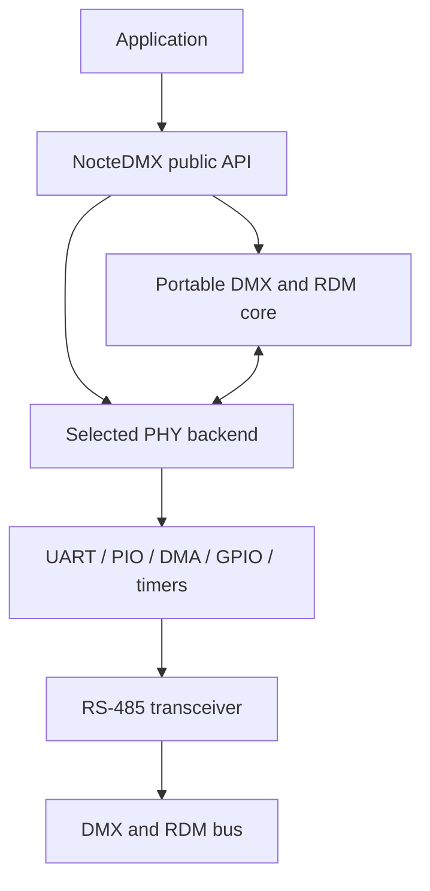

<div align="center">

# NocteDMX

**A portable, timing-aware DMX512-A and RDM library for embedded controllers.**

[](CHANGELOG.md)
[](https://github.com/IllumiNocte/NocteDMX/actions/workflows/ci.yml)
[](LICENSE)
[](#platform-status)
[](#project-status)

Built by [IllumiNocte](https://github.com/IllumiNocte) for reliable lighting
control, embedded nodes, test equipment, and future multi-platform use.

</div>

---

NocteDMX provides DMX input, DMX output, and bidirectional RDM through a small
public API. Protocol handling is being separated from UART, interrupt, GPIO,
and timing details so the same application code can later run on different
microcontroller families.

The first backend is the proven ESP8266 UART0 implementation used by the
uNode project. An experimental ESP32-S3 UART backend now provides DMX input
and output plus unicast RDM controller GET/SET, tested on UART1 and UART2 with an RP2040
fixture. S3 discovery/Mute/Unmute and bounded full scans are direct-UART tested.
Responder support, full timing and electrical
qualification remain pending.

Synthetic CPU/WLAN tests exposed an S3 controller TX-end timing issue, now
hardened with interrupt-driven turnaround and corroborated BREAK detection.
Retest results and an output-MAB anomaly investigated with independent PIO/DMA
timing windows are recorded in the
[validation notes](docs/esp32s3-rdm-validation.md). This is not full timing or
electrical qualification.

> [!IMPORTANT]
> NocteDMX is currently an early development release. The ESP8266 backend is
> usable, but the portable API and backend contract may still evolve before
> version 1.0.

## Highlights

- DMX512-A input and continuous output
- Atomic whole-frame updates and snapshots
- Bidirectional RDM controller and responder operation
- RDM discovery, GET, SET, broadcast, and response validation
- Shared or separately controlled RS-485 `DE` and active-low `/RE` pins
- No heap allocation in the timing-critical data path
- Hardware-independent protocol core
- Compatibility layer for existing `LXESP8266DMX` applications
- Focused Arduino examples that use only the public NocteDMX API

## Installation

### PlatformIO

Add the repository to `lib_deps`:

```ini
lib_deps =
    https://github.com/IllumiNocte/NocteDMX.git
```

### Arduino IDE

Download or clone the repository and place the `NocteDMX` directory in your
Arduino `libraries` directory. Restart the IDE afterwards; the examples will
appear below **File → Examples → NocteDMX**.

## Quick start

Include the public facade and obtain the port selected for the target:

```cpp
#include <NocteDMX.h>

nocte::dmx::Port& dmx = nocte::dmx::defaultPort();
```

### DMX output

```cpp
constexpr uint8_t kDirectionPin = 5;
constexpr uint16_t kChannels = nocte::dmx::kMinimumOutputSlots;

uint8_t frame[kChannels] = {};

void setup() {
  dmx.setDirectionPin(kDirectionPin);
  dmx.setFrame(frame, kChannels);
  dmx.startOutput();
}

void loop() {
  frame[0]++; // DMX address 1
  dmx.setFrame(frame, kChannels);
  delay(10);
}
```

### DMX input

Receive callbacks run in interrupt context. Keep them short and copy the frame
later from `loop()`:

```cpp
volatile bool frameAvailable = false;
uint8_t receivedFrame[nocte::dmx::kMaximumSlots] = {};

void NOCTE_DMX_ISR_ATTR onDmxFrame(int slots) {
  (void)slots;
  frameAvailable = true;
}

void setup() {
  dmx.setDirectionPin(5);
  dmx.setDataReceivedCallback(onDmxFrame);
  dmx.startInput();
}

void loop() {
  if (!frameAvailable) {
    return;
  }

  noInterrupts();
  frameAvailable = false;
  interrupts();

  const uint16_t slots = dmx.copyFrame(
      receivedFrame, sizeof(receivedFrame));
  // Process the copied frame here.
}
```

### Bidirectional RDM

ESP8266 provides the full current RDM API. ESP32-S3 provides the typed unicast
controller GET/SET, discovery and Mute/Unmute, without responder operation. Check
`Port::supportsRdmController`, `supportsRdmDiscovery` and `supportsRdmResponder`;
the broader legacy `supportsRdm` remains false on S3 until the full surface exists.

With `DE` and active-low `/RE` tied to one direction pin:

```cpp
dmx.startRDM(5, nocte::dmx::PortMode::Send);
```

With independently controlled transceiver pins:

```cpp
dmx.startRDM(
    DE_PIN,
    RE_NOT_PIN,
    nocte::dmx::PortMode::Send);
```

For bounded controller reads, use the typed API and check the actual payload:

```cpp
const nocte::dmx::core::Uid fixture(UINT64_C(0x7FF052444D01));
uint8_t info[25] = {};
const auto result = dmx.getRdmParameter(fixture, 0x0060, info, sizeof(info));
if (result.ok() && result.parameterDataLength == 19 && result.copiedLength == 19) {
  // DEVICE_INFO occupies 19 bytes; the remaining buffer bytes are untouched.
}
```

The result distinguishes ACK, NACK, deferred/overflow replies, timeout,
invalid responses, and invalid arguments. Deferred/overflow handling remains
the application's responsibility. SET accepts at most 231 parameter bytes.

## Examples

| Example | Demonstrates | Extra dependency |
| --- | --- | --- |
| [`DmxOutputFade`](examples/DmxOutputFade/DmxOutputFade.ino) | Atomic DMX output frames | — |
| [`DmxInput`](examples/DmxInput/DmxInput.ino) | Interrupt-safe DMX reception | — |
| [`DmxNeoPixelInput`](examples/DmxNeoPixelInput/DmxNeoPixelInput.ino) | Mapping DMX to RGB pixels | Adafruit NeoPixel |
| [`RdmControllerDiscovery`](examples/RdmControllerDiscovery/RdmControllerDiscovery.ino) | Discovery, GET, SET, and identify | — |
| [`RdmResponder`](examples/RdmResponder/RdmResponder.ino) | A minimal discoverable fixture | — |

See [the examples guide](examples/README.md) for wiring and usage notes.

## Testing

NocteDMX is tested independently from any consuming firmware:

- native C++ tests exercise the portable DMX/RDM core, including boundary
  handling, packet construction, checksum validation, timing failure flags,
  and discovery decoding;
- Arduino Lint checks library and release metadata;
- every public example is compiled against ESP8266 Arduino Core 3.1.2;
- DMX examples and S3 bench firmware are compiled against ESP32 Arduino Core
  3.3.12. A successful build is not a hardware or timing qualification;
- ELF guards check ESP8266 RDM timing helpers and S3 timing ISR placement and
  resolved flash dependencies, including size-optimized compiler outlining.

Run the portable tests locally with a CMake-compatible C++ compiler:

```sh
cmake -S . -B build -DCMAKE_BUILD_TYPE=Release
cmake --build build --config Release
ctest --test-dir build --build-config Release --output-on-failure
```

Hardware-in-the-loop tests are intentionally separate from CI. They require a
real controller and the RP2040/RP2350 DMX test fixture. Direct 3.3-V UART wiring
tests protocol behavior; electrical qualification requires RS-485 hardware.
The [standalone HIL runner](tests/hil/README.md) flashes focused test sketches
and checks DMX output/input, RDM GET/SET/discovery, invalid responses, and
recovery without the uNode application. These are regression smoke tests,
not a complete standards-conformance certification.
ESP8266 and S3 also have synthetic compute/AP-scan load tests and independent
RP2040 PIO/DMA output-timing windows. These finite windows are not a continuous
oscilloscope trace or a cache-off/NMI/physical-bus qualification.

## Architecture



The portable core owns protocol limits, UID/device-table utilities, frame and
transaction storage, DMX frame operations, DMX receive assembly, RDM packet
construction, discovery decoding, and response validation. S3 uses the portable
DMX receiver and bounded normal RDM response receiver. Both backends use shared
typed GET/SET packet construction and response classification; the ESP8266
scheduler retains its original receive assembly and sequencing. A PHY backend owns:

- UART, PIO, timer, and DMA resources
- pin routing and RS-485 direction control
- BREAK and Mark-After-Break generation and detection
- receive-idle, framing-error, and transmission-complete events
- interrupt-safe timestamps and platform-specific critical sections

For the detailed boundary and porting sequence, see
[`docs/architecture.md`](docs/architecture.md).

## Platform status

| Target | Status | Notes |
| --- | --- | --- |
| ESP8266 | Supported | UART0 input/output and bidirectional RDM |
| ESP32-S3 | Experimental, UART1/2 tested | DMX input/output, RDM GET/SET/discovery/Mute/Unmute; responder/multi-port/full qualification pending |
| RP2040 / RP2350 | Roadmap | Suitable candidate for a PIO-based backend |
| STM32 | Roadmap | Hardware-UART backend planned |
| AVR | Exploratory | Subject to RAM and timer/UART constraints |

## ESP8266 notes

The current backend uses UART0:

| Signal | ESP8266 pin |
| --- | --- |
| DMX transmit | GPIO1 / UART0 TX |
| DMX receive | GPIO3 / UART0 RX |
| RS-485 direction | User-selected GPIO |

An external RS-485 transceiver is required. Never connect an ESP8266 GPIO
directly to a DMX line.

UART0 is occupied while DMX or RDM is active, so `Serial.begin()` and other
UART0 logging must not be used at the same time. Depending on the board, the
transceiver may also need to be disabled during flashing and boot.
Port objects can be constructed independently, but only one may own UART0 at
a time. Check `isActive()` after starting. Use `setUid(core::Uid(...))` on the
port for a per-instance RDM identity; the static legacy identity remains the
fallback when no per-instance identity is configured.

## Project status

The current migration is intentionally incremental so the ESP8266 firmware
continues to build after each step.

- [x] Rename the maintained library to NocteDMX
- [x] Add the stable `<NocteDMX.h>` facade
- [x] Isolate the ESP8266 implementation as a backend
- [x] Extract common constants, frame operations, and RDM packet validation
- [x] Replace the historical examples with public-API examples
- [x] Move frame and RDM transaction storage into the shared core
- [x] Add constructible ports with per-instance UID and exclusive UART ownership
- [ ] Extract shared receive assembly and controller transaction sequencing
- [x] Add an experimental ESP32-S3 UART backend for DMX input/output
- [x] Add standalone RP2040 HIL tests for the ESP8266 backend
- [x] Validate S3 UART1 DMX input/output, fault recovery and lifecycle on direct UART
- [x] Repeat S3 DMX/RDM/discovery matrices on UART2 with unchanged TX17/RX18 wiring
- [x] Validate S3 DMX/RDM/discovery fault recovery and synthetic load on direct UART
- [x] Harden and retest ESP8266 RDM with IRQ/WLAN load and independent output timing
- [ ] Qualify simultaneous S3 UART1 + UART2 operation on separate pins
- [x] Add shared normal RDM capture and S3 unicast controller GET/SET
- [x] Add S3 discovery/Mute/Unmute and a bounded full-scan helper
- [x] Validate S3 discovery/Mute/Unmute on the direct-UART bench
- [ ] Qualify S3 RDM on RS485 under load
- [ ] Add S3 responder operation

## ESP32-S3 UART bench

The default port uses UART1, TX **GPIO17**, RX **GPIO18**, leaving UART0 and
native USB available for programming/logging. UART2 and other suitable pins
can be selected before starting the port. Other ESP32 variants are not supported.

For a direct **3.3-V UART** connection to the RP2040 tester:

| ESP32-S3 | RP2040 tester |
| --- | --- |
| GPIO17 TX | GPIO1 RX |
| GPIO18 RX | GPIO0 TX |
| GND | GND |

Use `setDirectionPin(255)` to disable direction GPIOs. This is a crossed UART
bench connection, **not** a connection to a DMX/RS-485 line. Only one device
should transmit during each DMX input/output test.

[`Esp32S3UartBench`](extras/hil/Esp32S3UartBench/Esp32S3UartBench.ino) starts in
input mode and accepts `input`, `output`, `output24`, `stop`, `status`, `frame`,
`quiet` and `verbose` through USB CDC.
See [the S3 bring-up guide](docs/esp32s3.md) for the build command, backend
constraints and the remaining hardware tests.
The first [S3 hardware validation record](docs/esp32s3-validation.md) documents
15 passing bench cases and the measured scope, without claiming certification.

## Compatibility

Existing applications can continue to include `LXESP8266UARTDMX.h` or
`uNodeESP8266DMX.h` and use `LX8266DMX` plus the global `ESP8266DMX` object.
New applications should use `<NocteDMX.h>` and the `nocte::dmx` namespace.

The compatibility layer will remain during the migration and will only be
removed in a separately announced major release.

## Origin and attribution

The ESP8266 backend began as the uNode-maintained fork of Claude Heintz's
`LXESP8266DMX` library, based on upstream commit
`760972edc8e9239692a7a47f3db275ac64f7d5b8` from 2022-04-11.

The original copyright notices and BSD 3-Clause attribution are retained.
ESP8266 UART helpers derived from the Arduino core retain their corresponding
LGPL attribution in the source.

## License

NocteDMX is distributed under the [BSD 3-Clause License](LICENSE).

Copyright © 2015–2017 Claude Heintz<br>
Copyright © 2026 IllumiNocte
